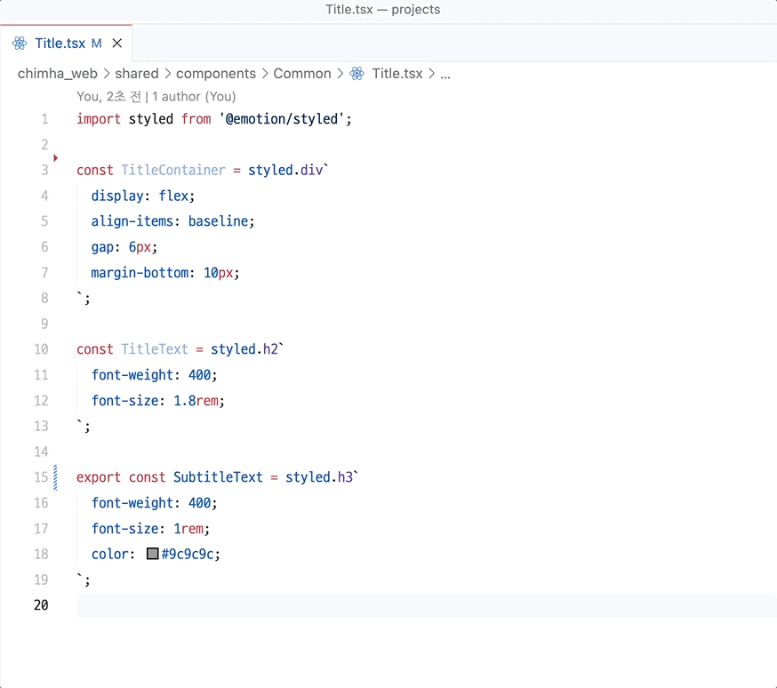

# VS Code Auto Export JavaScript

Automaically export javascript variables or functions. Works with JavaScript (ES6) and TypeScript (TS).

## Usage



## Features

### Export All as Named

```javascript
const foo = ''
interface bar {}

export { var1 }
export type { foo } // support type-only export
```
